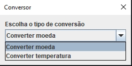
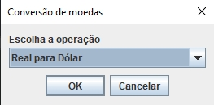
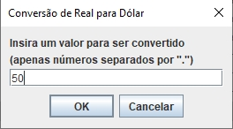
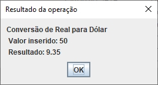
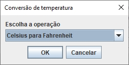
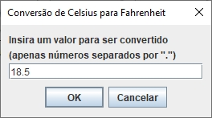
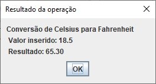
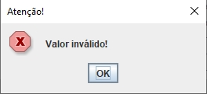
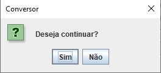
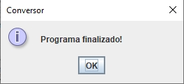

# Conversor de moedas e temperatura | Java

 
 

Um conversor de moedas e temperatura desenvolvido com Java (JDK 18) e utilizando JOptionPane para a interface gráfica.

**Cotações das moedas: 27/09/2022**

  

## Índice

- [Conversão de moedas](#convertendo-moedas)
- [Conversão de temperatura](#convertendo-temperatura)
- [Alerta e encerramento](#alerta-e-encerramento)
- [Acesso ao projeto](#acesso-ao-projeto)

## Convertendo moedas

Após selecionar a opção "Converter moeda", é possível realizar as seguintes operações:
- Real para Dólar - Dólar para Real
- Real para Euro - Euro para Real
- Real para Libra Esterlina - Libra Esterlina para Real
- Real para Peso Argentino - Peso Argentino para Real
- Real para Peso Chileno - Peso Chileno para Real

Depois de selecionar a operação, insira o valor que deseja converter (apenas números, positivos ou negativos, com ponto flutuante) e o programa mostrará o resultado.

  
  
  

## Convertendo temperatura

Após selecionar a opção "Converter temperatura", é possível realizar as seguintes operações:
- Celsius para Fahrenheit
- Celsius para Kelvin
- Fahrenheit para Celsius
- Fahrenheit para Kelvin
- Kelvin para Celsius
- Kelvin para Fahrenheit

Depois de selecionar a operação, insira o valor que deseja converter (apenas números, positivos ou negativos, com ponto flutuante) e o programa mostrará o resultado.

  
  
  

---

### Alerta e encerramento

Caso seja inserido um valor inválido (não numérico) ou não seja inserido valor nenhum, o programa mostrará uma mensagem de alerta para o usuário.
Sempre após o alerta ou uma operação bem sucedida, o programa deverá perguntar ao usuário se ele deseja continuar; em caso afirmativo, o programa retorna a tela inicial, mas caso o usuário clique em "Não", o programa exibe uma mensagem de finalização e é encerrado.

  
  
  

---

### Acesso ao projeto

📁 Download do projeto completo (.zip): [Baixar projeto](https://github.com/xLucaspx/conversor-java/archive/refs/heads/main.zip "Baixar projeto .zip")

💾 Download apenas do arquivo executável (.jar): [Baixar arquivo](https://github.com/xLucaspx/conversor-java/raw/main/Conversor.jar "Baixar arquivo .jar")

Talvez seja necessário ter a versão 18 ou superior do Java para rodar o programa.

---
